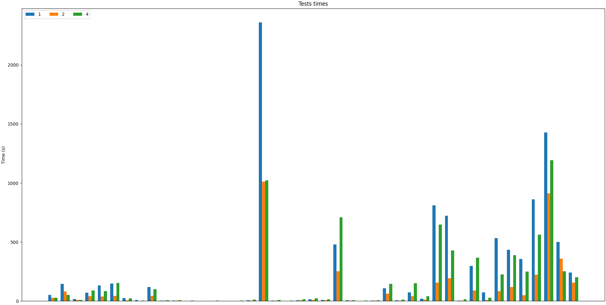
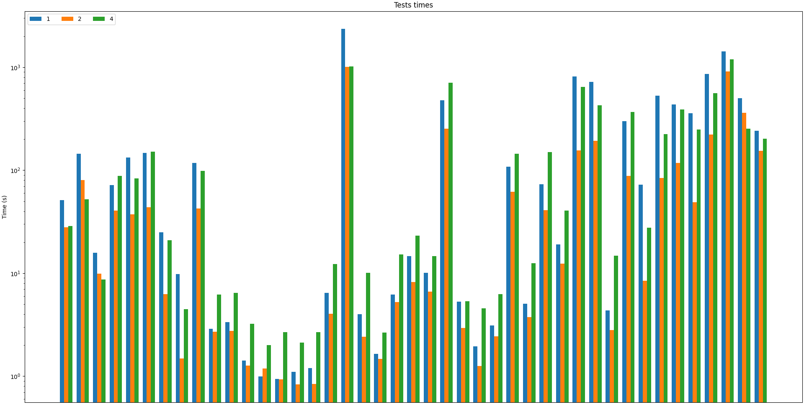

0. The goal of phase 2b is to perform benchmarking/scalability tests of sample three-tier lakehouse solution.

1. In main.tf, change machine_type at:

```
module "dataproc" {
  depends_on   = [module.vpc]
  source       = "github.com/bdg-tbd/tbd-workshop-1.git?ref=v1.0.36/modules/dataproc"
  project_name = var.project_name
  region       = var.region
  subnet       = module.vpc.subnets[local.notebook_subnet_id].id
  machine_type = "e2-standard-2"
}
```

and subsititute "e2-standard-2" with "e2-standard-4".

2. If needed request to increase cpu quotas (e.g. to 30 CPUs):
   https://console.cloud.google.com/apis/api/compute.googleapis.com/quotas?project=tbd-2023z-9918

3. Using tbd-tpc-di notebook perform dbt run with different number of executors, i.e., 1, 2, and 5, by changing:

```
 "spark.executor.instances": "2"
```

in profiles.yml.

4. In the notebook, collect console output from dbt run, then parse it and retrieve total execution time and execution times of processing each model. Save the results from each number of executors.

5. Analyze the performance and scalability of execution times of each model. Visualize and discucss the final results.

# Rozwiązanie:

Łączne czasy wykonania dla różnych wartości parametru `spark.executor.instances`:

- 1 - 168 minut
- 2 - 68 minut
- 4 - 121 minut

Wykres przedstawiający czasy wykonania poszczególnych testów dla różnych wartości parametru:



Ten sam wykres po zastosowaniu skali logarytmicznej:



Jak widać najszybszy wykonanie uzyskane zostało dla wartości `2`. Zmiana wartości na `4` prawie dwukrotnie zwiększyło łączny czas wykonania (z 68 minuat na 121 minut), natomiast zmniejszenie do wartości `1` wydłużyło wykonanie o kolejne 47 minut.

Może być to spowodowane tym, że każdy executor konkuruje o zasoby, na przykład CPU i wykonuje nadmiarowe połączenia lub ich zmiany. Infrastruktura może również być niedostosowana do równoległych operacji.
