IMPORTANT ❗ ❗ ❗ Please remember to destroy all the resources after each work session. You can recreate infrastructure by creating new PR and merging it to master.
  


1. Authors:

   Grupa nr 6:

   - Piotr Gręda 310704
   - Szymon Skarzyński 310893
   - Jakub Smela 310900

   [https://github.com/ptgreda/tbd-workshop-1](https://github.com/ptgreda/tbd-workshop-1)
   
2. Follow all steps in README.md.

3. Select your project and set budget alerts on 5%, 25%, 50%, 80% of 50$ (in cloud console -> billing -> budget & alerts -> create buget; unclick discounts and promotions&others while creating budget).

  

  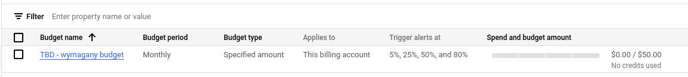

5. From avaialble Github Actions select and run destroy on main branch.

  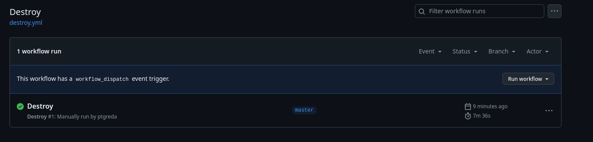
   
6. Create new git branch and:
    1. Modify tasks-phase1.md file.
    
    2. Create PR from this branch to **YOUR** master and merge it to make new release. 

    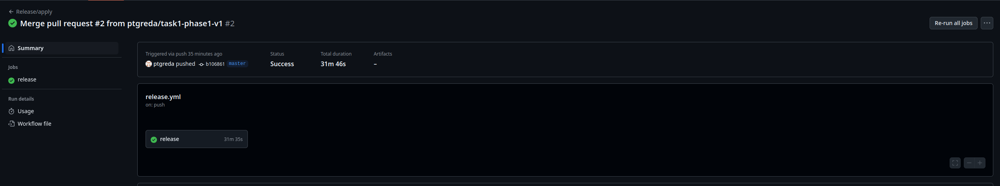


7. Analyze terraform code. Play with terraform plan, terraform graph to investigate different modules.

    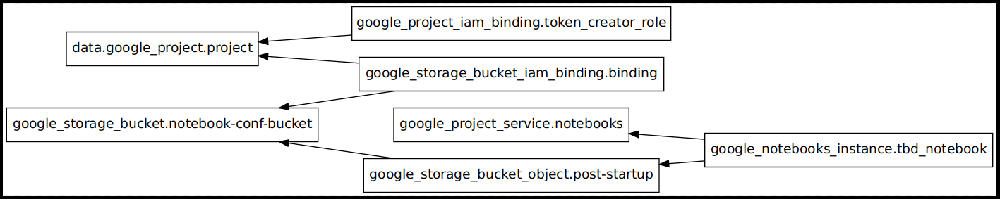
   
8. Reach YARN UI
    Aby utworzyć tunel, który pozwoli na połączenie z YARN UI należy wywołać komendę, w której wyspecyfikujemy projekt, z jakiego korzystamy, strefę, port:

    ```
    gcloud compute ssh tbd-cluster-m --project=tbd-2024z-310893 --zone=europe-west1-d -- -D 1080 -N
    ```
    Niestety w naszym przypadku pojawił się problem z IAPem, więc przekierowaliśmy porty:
    ```
    gcloud compute ssh tbd-cluster-m --project=tbd-2024z-310893 --zone=europe-west1-d --tunnel-through-iap -- -L 8088:localhost:8088
    ```
    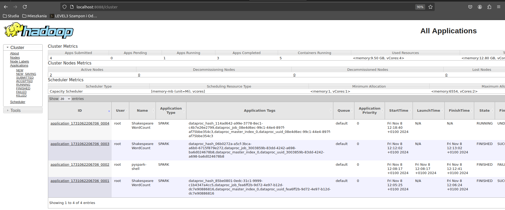
   
9.  Draw an architecture diagram (e.g. in draw.io) that includes:
    1. VPC topology with service assignment to subnets
    2. Description of the components of service accounts
    3. List of buckets for disposal
    4. Description of network communication (ports, why it is necessary to specify the host for the driver) of Apache Spark running from Vertex AI Workbech
  
    ***place your diagram here***

10. Create a new PR and add costs by entering the expected consumption into Infracost
For all the resources of type: `google_artifact_registry`, `google_storage_bucket`, `google_service_networking_connection`
create a sample usage profiles and add it to the Infracost task in CI/CD pipeline. Usage file [example](https://github.com/infracost/infracost/blob/master/infracost-usage-example.yml) 

```version: 0.1
usage:
  google_artifact_registry.registry:
    storage_gb: 100

  google_storage_bucket.tbd-state-bucket:
    storage_gb: 150
    monthly_class_a_operations: 400
    monthly_class_b_operations: 200
    monthly_egress_data_gb: 50

  google_storage_bucket.tbd_code_bucket:
    storage_gb: 100
    monthly_class_a_operations: 1000
    monthly_class_b_operations: 200
    monthly_egress_data_gb: 100

  google_storage_bucket.tbd_data_bucket:
    storage_gb: 200
    monthly_class_a_operations: 2500
    monthly_class_b_operations: 500
    monthly_egress_data_gb: 100

  google_storage_bucket.notebook-conf-bucket:
    storage_gb: 100
    monthly_class_a_operations: 1000
    monthly_class_b_operations: 200
    monthly_egress_data_gb: 100

  google_storage_bucket.mlflow_artifacts_bucket:
    storage_gb: 100
    monthly_class_a_operations: 1000
    monthly_class_b_operations: 200
    monthly_egress_data_gb: 100

  google_service_networking_connection.private_vpc_connection:
    monthly_data_processed_gb: 200
```

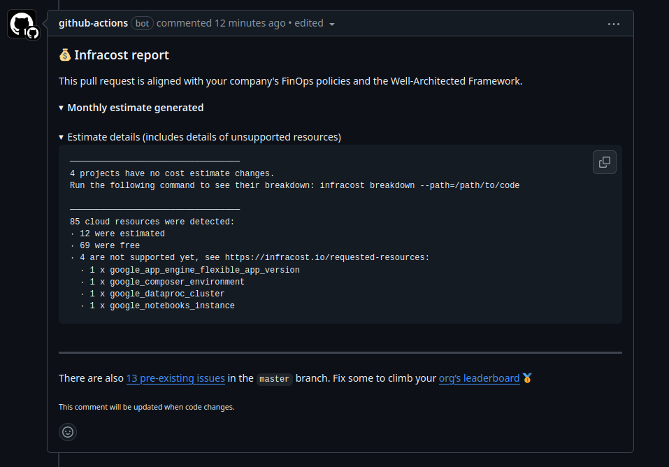
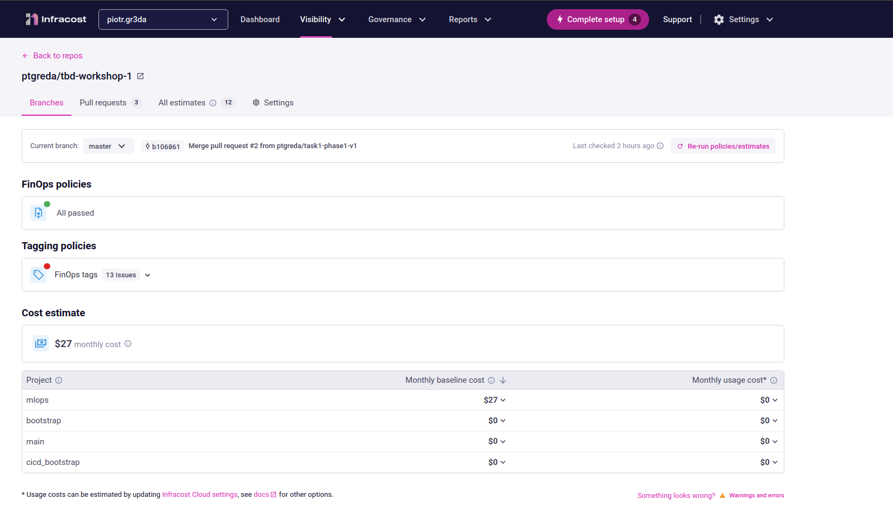

11.   Create a BigQuery dataset and an external table using SQL
    
  Po kilku godzinach prób udało się rozwiązać problem.  
  Wynikał on z tego, że dataset nie był pobrany - nie istniał w żadnym z kubełków.  
  Żeby to naprawić, należało poprawić skrypt spark-job ustawiając prawidłową wartość ścieżki do kubełka.  
  Dodatkowo napotkaliśmy problem z lokalizacją query - należało zmienić ją w ustawieniach.
  Ten punkt wykonaliśmy po ukończeniu punktów 12 i 13. 

  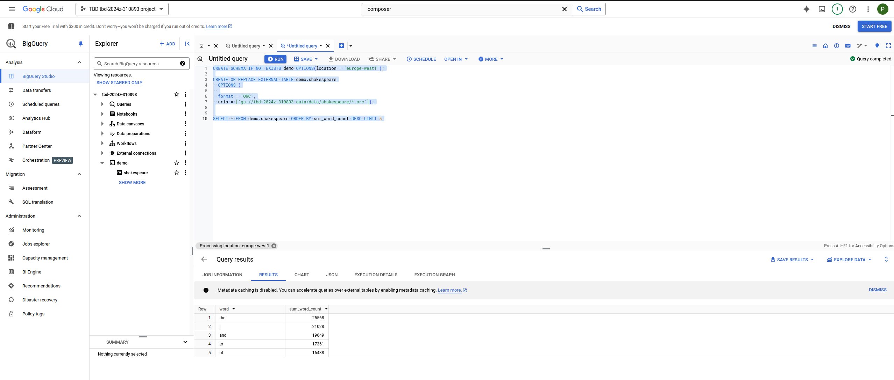
   
  ORC nie wymaga table schema, ponieważ informacja o nim zawarta jest w pliku.
  Dzięki temu nie ma potrzeby posiadania schematu jako takiego.

  
12.  Start an interactive session from Vertex AI workbench:

  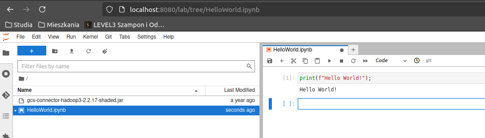
   
13.  Find and correct the error in spark-job.py

  Problem wynikał z błędnej ścieżki umieszczonej w pliku `spark-job.py`
  Znalazłem to poprzez dwókrotne uruchomienie daga `dataproc_job`, a następnie wczytanie się w logi problemu.
  
  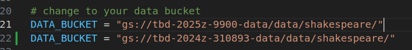

  Po poprawieniu dag przeszedł poprawnie:

  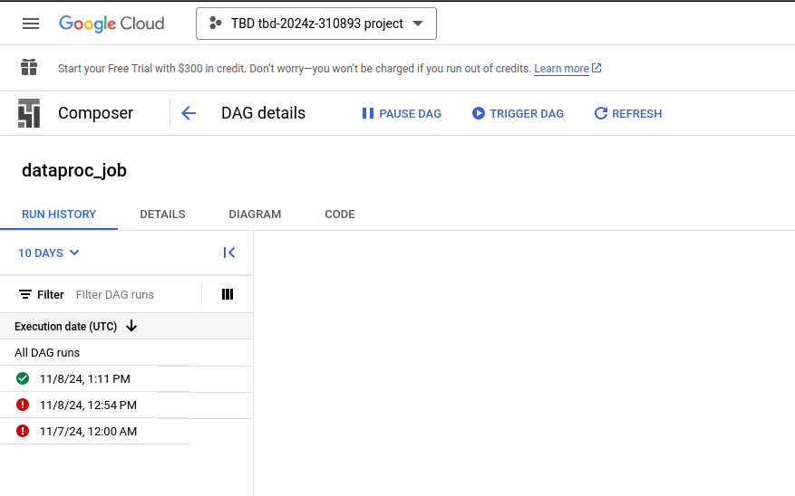


14. **Additional tasks using Terraform:**

    1. **Add support for arbitrary machine types and worker nodes for a Dataproc cluster and JupyterLab instance**

        ### Dataproc cluster

        ['modules/dataproc/variables.tf'](modules/dataproc/variables.tf)
        
        Żeby dodać takie wsparcie, należy posługiwać się nie bezpośrednio wartościami liczbowymi, lecz pewnymi zmiennymi.  
        Wsparcie dla zmiennej `machine_type` jest już dodane, więc analogicznie zrobiliśmy `worker nodes`:

        ```hcl
        variable "worker_count" {
          type        = number
          default     = 2
          description = "Number of worker nodes"
        }
        ```

        ['modules/dataproc/main.tf'](modules/dataproc/main.tf)

        ```hcl
        worker_config {
          num_instances = var.worker_count
          machine_type  = var.machine_type
          disk_config {
            boot_disk_type    = "pd-standard"
            boot_disk_size_gb = 100
          }
        }
        ```

        ### JupyterLab
        Dodaliśmy tutaj obsługę machine_type, której brakowało. Można analogicznie dodać tutaj worker_count.

        ['modules/vertex-ai-workbench/variables.tf'](modules/vertex-ai-workbench/variables.tf)

        ```hcl
          variable "machine_type" {
          type        = string
          default     = "e2-medium"
          description = "Machine type to use for the notebook instance"
        }
        ```

        ['modules/vertex-ai-workbench/main.tf'](modules/vertex-ai-workbench/main.tf)

        ```hcl
        resource "google_notebooks_instance" "tbd_notebook" {
          #checkov:skip=CKV2_GCP_18: "Ensure GCP network defines a firewall and does not use the default firewall"
          #checkov:skip=CKV2_GCP_21: "Ensure Vertex AI instance disks are encrypted with a Customer Managed Key (CMK)"
          depends_on   = [google_project_service.notebooks]
          location     = local.zone
          machine_type = var.machine_type
          name         = "${var.project_name}-notebook"
          container_image {
            repository = var.ai_notebook_image_repository
            tag        = var.ai_notebook_image_tag
          }
          network = var.network
          subnet  = var.subnet
          ## change it to break the checkov during the labs
          # FIXME:remove
          no_public_ip    = true
          no_proxy_access = true
          # end
          instance_owners = [var.ai_notebook_instance_owner]
          metadata = {
            vmDnsSetting : "GlobalDefault"
          }
          post_startup_script = "gs://${google_storage_bucket_object.post-startup.bucket}/${google_storage_bucket_object.post-startup.name}"
        }
        ```


    2. **Add support for preemptible/spot instances in a Dataproc cluster**

      Dodano tutaj zmienną preemptible_worker_count, która mówi ile instancji takiego obiektu powinno być tworzone.

      ['modules/dataproc/variables.tf'](modules/dataproc/variables.tf)

      ```hcl
      variable "preeemptible_worker_count" {
        type        = number
        default     = 0
        description = "Number of preemptible worker nodes"
      }
      ```

      ['modules/dataproc/variables.tf'](modules/dataproc/variables.tf)

      ```hcl
        preemptible_worker_config {
        num_instances = var.preeemptible_worker_count

        disk_config {
          boot_disk_type    = "pd-standard"
          boot_disk_size_gb = 100
        }
        preemptibility = "SPOT"
      }
      ```

    3. **Perform additional hardening of JupyterLab environment, i.e., disable sudo access and enable secure boot**

        W celu wyłączenia dostępu do sudo należy ustawić pole `notebook-disable-root` na wartość true.
        Dodatkowo aby uruchomić secure boot trzeba zmienić flagę enable_secure_boot.

        ['modules/dataproc/variables.tf'](modules/dataproc/variables.tf)

      ```hcl
      metadata = {
        vmDnsSetting : "GlobalDefault"
        notebook-disable-root : true
      }
      post_startup_script = "gs://${google_storage_bucket_object.post-startup.bucket}/${google_storage_bucket_object.post-startup.name}"

      shielded_instance_config {
        enable_secure_boot = true
      }
      ```

    4. **(Optional) Get access to Apache Spark WebUI**

    W tym celu trzeba ustawić dostęp po http

      ```hcl
      cluster_config {
        endpoint_config {
          enable_http_port_access = "true"
        }
      }
      ```


